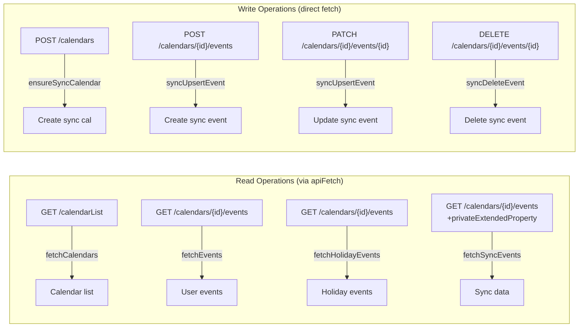

# API Reference

## Google Calendar API v3 Endpoints

All requests use the base URL `https://www.googleapis.com/calendar/v3` and require an Authorization header:

```
Authorization: Bearer {access_token}
```

### API Helper Function

All read operations go through `apiFetch()`:

```javascript
async function apiFetch(url) {
  try {
    const resp = await fetch(url, {
      headers: { Authorization: 'Bearer ' + accessToken },
    });
    if (resp.status === 401) {
      tokenClient.requestAccessToken();  // Re-auth
      return null;
    }
    if (!resp.ok) {
      console.error('API error', resp.status, await resp.text());
      return null;
    }
    return await resp.json();
  } catch (err) {
    console.error('Fetch error:', err);
    return null;
  }
}
```

Write operations (sync) use `fetch()` directly with POST/PATCH/DELETE methods.

---

## Endpoints Used

### 1. List Calendars

```
GET /users/me/calendarList
```

**Used by:** `fetchCalendars()`

**Purpose:** Get all calendars the user has access to. Used to:
- Populate the Calendars settings panel
- Match country holiday calendar IDs
- Find the sync calendar

**Response shape:**
```json
{
  "items": [
    {
      "id": "primary",
      "summary": "Jacob Miller",
      "backgroundColor": "#4285f4",
      "accessRole": "owner"
    },
    {
      "id": "en.usa#holiday@group.v.calendar.google.com",
      "summary": "Holidays in United States",
      "accessRole": "reader"
    }
  ]
}
```

---

### 2. List Events

```
GET /calendars/{calendarId}/events?timeMin=...&timeMax=...&singleEvents=true&orderBy=startTime&maxResults=2500
```

**Used by:** `fetchEvents()`, `fetchHolidayEvents()`

**Parameters:**

| Param | Value | Purpose |
|-------|-------|---------|
| `timeMin` | ISO 8601 | First day of month |
| `timeMax` | ISO 8601 | Last day of month |
| `singleEvents` | `true` | Expand recurring events |
| `orderBy` | `startTime` | Chronological order |
| `maxResults` | `2500` | Max events per page |

**Response shape:**
```json
{
  "items": [
    {
      "id": "abc123",
      "summary": "Team Meeting",
      "start": { "dateTime": "2026-03-15T10:00:00-07:00" },
      "end": { "dateTime": "2026-03-15T11:00:00-07:00" }
    },
    {
      "id": "def456",
      "summary": "trip ideas - 75% Tokyo",
      "start": { "date": "2026-03-20" },
      "end": { "date": "2026-03-25" }
    }
  ]
}
```

---

### 3. List Sync Events

```
GET /calendars/{syncCalId}/events?timeMin=...&timeMax=...&singleEvents=true&maxResults=250&privateExtendedProperty=mpApp%3Dmonthplanner
```

**Used by:** `fetchSyncEvents()`

**Key difference:** Uses `privateExtendedProperty` filter to only return Month Planner data events.

**Response shape:**
```json
{
  "items": [
    {
      "id": "sync789",
      "summary": "R3: Confident | Trip to Tokyo",
      "description": "Trip to Tokyo",
      "start": { "date": "2026-03-15" },
      "end": { "date": "2026-03-16" },
      "extendedProperties": {
        "private": {
          "mpApp": "monthplanner",
          "mpReserved": "3",
          "mpNote": "Trip to Tokyo"
        }
      }
    }
  ]
}
```

---

### 4. Create Calendar

```
POST /calendars
Content-Type: application/json

{
  "summary": "Month Planner Sync",
  "description": "Auto-created by Month Planner app. Stores reserved levels and notes."
}
```

**Used by:** `ensureSyncCalendar()`

**Called once** — only when the sync calendar doesn't exist yet.

---

### 5. Create Sync Event

```
POST /calendars/{syncCalId}/events
Content-Type: application/json

{
  "summary": "R3: Confident",
  "description": "Note text here",
  "start": { "date": "2026-03-15" },
  "end": { "date": "2026-03-16" },
  "extendedProperties": {
    "private": {
      "mpApp": "monthplanner",
      "mpReserved": "3",
      "mpNote": "Note text here"
    }
  }
}
```

**Used by:** `syncUpsertEvent()` — when no existing event for that date

---

### 6. Update Sync Event

```
PATCH /calendars/{syncCalId}/events/{eventId}
Content-Type: application/json

{
  "summary": "R2: Considering",
  "description": "Updated note",
  "extendedProperties": {
    "private": {
      "mpApp": "monthplanner",
      "mpReserved": "2",
      "mpNote": "Updated note"
    }
  }
}
```

**Used by:** `syncUpsertEvent()` — when `syncEventIds[dk]` exists

---

### 7. Delete Sync Event

```
DELETE /calendars/{syncCalId}/events/{eventId}
```

**Used by:** `syncDeleteEvent()` — when both reserved=0 and note is empty

---

## API Call Map



## Error Handling

| HTTP Status | Handler | Action |
|-------------|---------|--------|
| 200 | All | Process response |
| 401 | `apiFetch()` | Request new access token |
| 403 | Sync functions | Log error, show "Sync error" |
| Other | All | Log to console, return null |

## Utility Functions

### dateKey(d)
Converts a Date object to `"YYYY-MM-DD"` string:
```javascript
function dateKey(d) {
  return `${d.getFullYear()}-${String(d.getMonth()+1).padStart(2,'0')}-${String(d.getDate()).padStart(2,'0')}`;
}
```

### formatTime(isoStr)
Converts ISO timestamp to 12-hour format:
```javascript
function formatTime(isoStr) {
  const d = new Date(isoStr);
  let h = d.getHours();
  const m = String(d.getMinutes()).padStart(2, '0');
  const ampm = h >= 12 ? 'PM' : 'AM';
  h = h % 12 || 12;
  return `${h}:${m} ${ampm}`;
}
```

### esc(str)
HTML-escapes a string for safe insertion:
```javascript
function esc(str) {
  const div = document.createElement('div');
  div.textContent = str;
  return div.innerHTML.replace(/"/g, '&quot;');
}
```

### nextDay(dateStr)
Returns the next day's date string (for all-day event end dates):
```javascript
function nextDay(dateStr) {
  const d = new Date(dateStr + 'T00:00:00');
  d.setDate(d.getDate() + 1);
  return dateKey(d);
}
```
