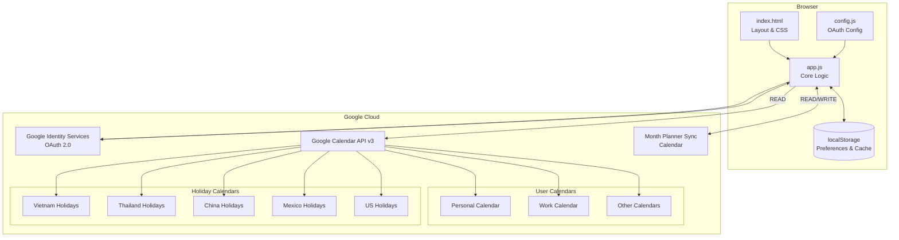
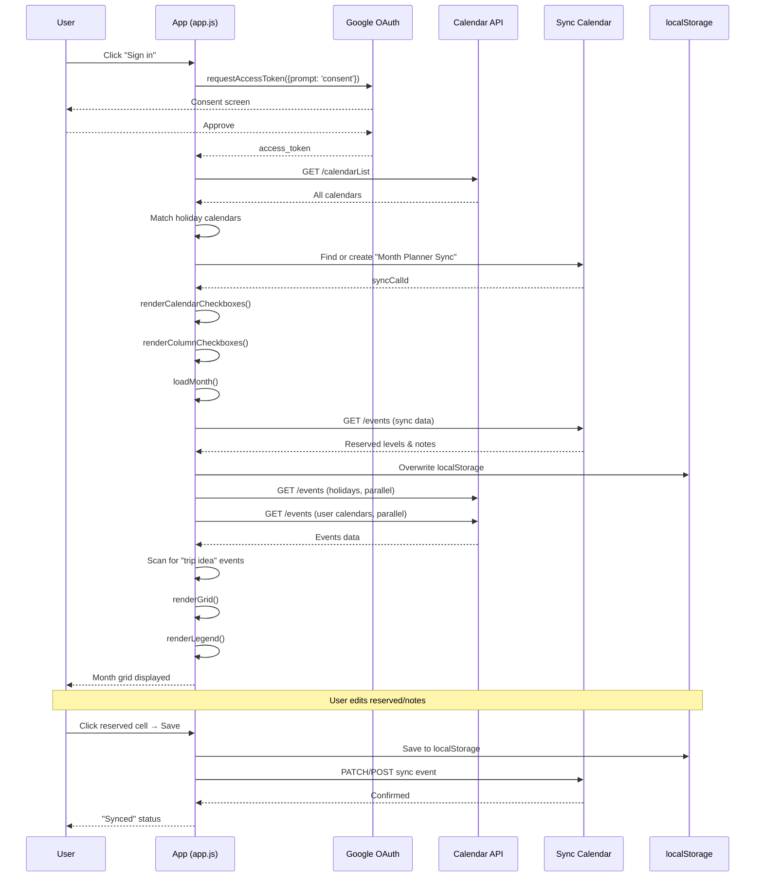
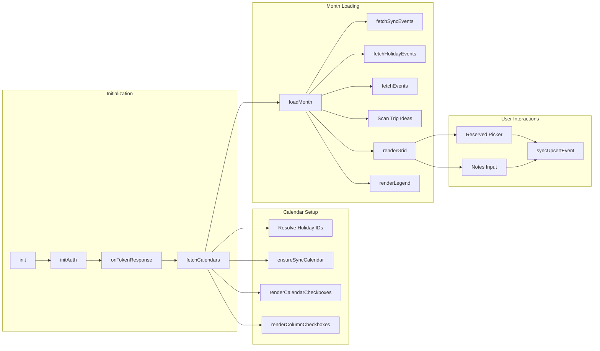

# Architecture Overview

## High-Level System Diagram

## Application Flow

## Component Architecture

## Design Principles

1. **No build step** — Vanilla JS, load directly in browser
2. **Minimal permissions** — Only requests what's needed from Google
3. **Offline-capable** — localStorage provides immediate data, sync is additive
4. **Single-page** — All rendering happens client-side via DOM manipulation
5. **Progressive enhancement** — Works read-only without sync; sync adds persistence
