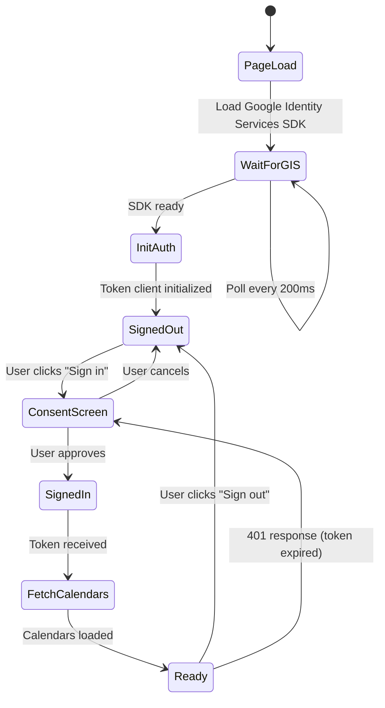

# Authentication & OAuth Flow

## Overview

The app uses **Google Identity Services (GIS)** for browser-based OAuth 2.0 authentication. This provides access to the Google Calendar API without a backend server.

## OAuth Configuration

```javascript
// config.js
const CLIENT_ID = '883236080930-...apps.googleusercontent.com';
const SCOPES = 'https://www.googleapis.com/auth/calendar';
```

| Scope | Purpose |
|-------|---------|
| `calendar` | Full read/write access to Google Calendar (needed for sync) |

> **Note:** The app previously used `calendar.readonly`. The full `calendar` scope was required to enable the 2-way sync feature that creates and updates events.

## Auth Flow Diagram



## Code Walkthrough

### 1. SDK Loading

The Google Identity Services SDK is loaded asynchronously in `index.html`:

```html
<script src="https://accounts.google.com/gsi/client" async defer></script>
```

The app polls for availability since the script loads asynchronously:

```javascript
// app.js — init()
window.addEventListener('load', () => {
  if (typeof google !== 'undefined' && google.accounts) {
    initAuth();
  } else {
    const interval = setInterval(() => {
      if (typeof google !== 'undefined' && google.accounts) {
        clearInterval(interval);
        initAuth();
      }
    }, 200);
  }
});
```

### 2. Token Client Initialization

```javascript
// app.js — initAuth()
function initAuth() {
  tokenClient = google.accounts.oauth2.initTokenClient({
    client_id: CLIENT_ID,
    scope: SCOPES,
    callback: onTokenResponse,
  });
  authBtn.onclick = () => {
    if (accessToken) {
      signOut();
    } else {
      tokenClient.requestAccessToken({ prompt: 'consent' });
    }
  };
}
```

The `prompt: 'consent'` parameter forces Google to show the consent screen, ensuring the user grants the latest scope permissions.

### 3. Token Handling

```javascript
// app.js — onTokenResponse()
function onTokenResponse(resp) {
  if (resp.error) {
    console.error('Auth error:', resp);
    return;
  }
  accessToken = resp.access_token;
  authBtn.textContent = 'Sign out';
  signInPrompt.style.display = 'none';
  fetchCalendars();
}
```

### 4. Token Refresh

When an API call returns 401, the app automatically requests a new token:

```javascript
// app.js — apiFetch()
async function apiFetch(url) {
  const resp = await fetch(url, {
    headers: { Authorization: 'Bearer ' + accessToken },
  });
  if (resp.status === 401) {
    tokenClient.requestAccessToken();  // Re-triggers consent
    return null;
  }
  // ...
}
```

### 5. Sign Out

```javascript
// app.js — signOut()
function signOut() {
  if (accessToken) {
    google.accounts.oauth2.revoke(accessToken);
  }
  accessToken = null;
  allCalendars = [];
  selectedCalendarIds = [];
  eventsCache = {};
  tripIdeaDates = {};
  syncCalId = null;
  syncEventIds = {};
  syncReady = false;
  updateSyncStatus('');
  // ... reset UI
}
```

## Google Cloud Setup

To configure your own instance:

1. Go to [Google Cloud Console](https://console.cloud.google.com/)
2. Create a new project (or select existing)
3. Enable the **Google Calendar API** under APIs & Services → Library
4. Go to APIs & Services → Credentials
5. Create an **OAuth 2.0 Client ID** (type: Web application)
6. Add `http://localhost:8000` to **Authorized JavaScript origins**
7. Copy the Client ID into `config.js`
