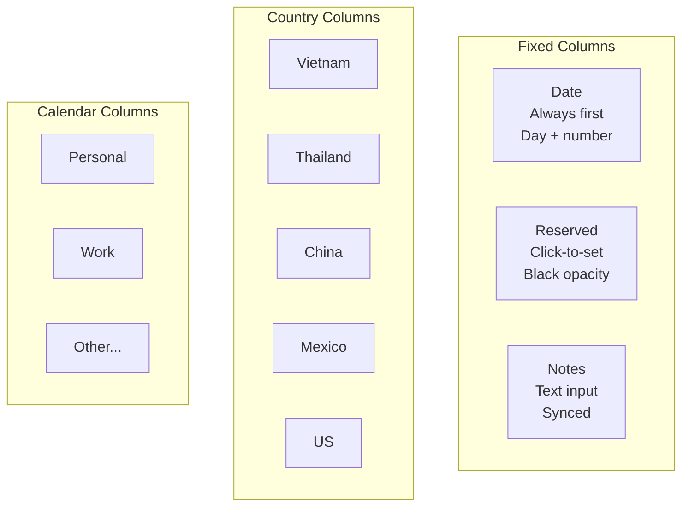
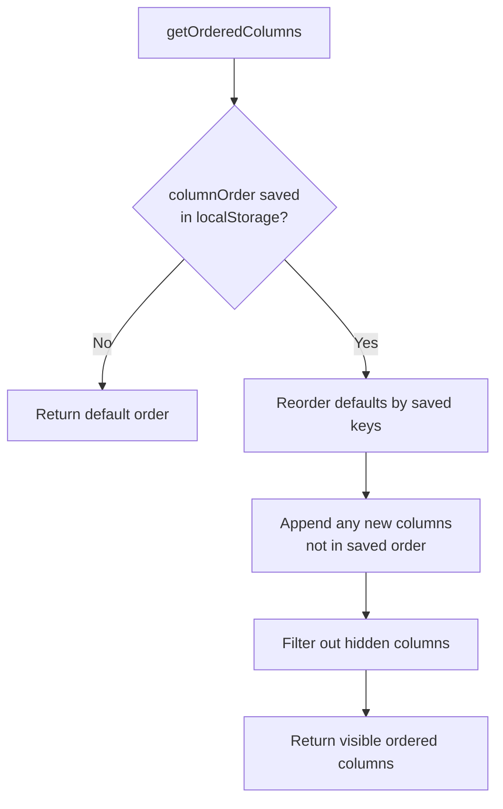
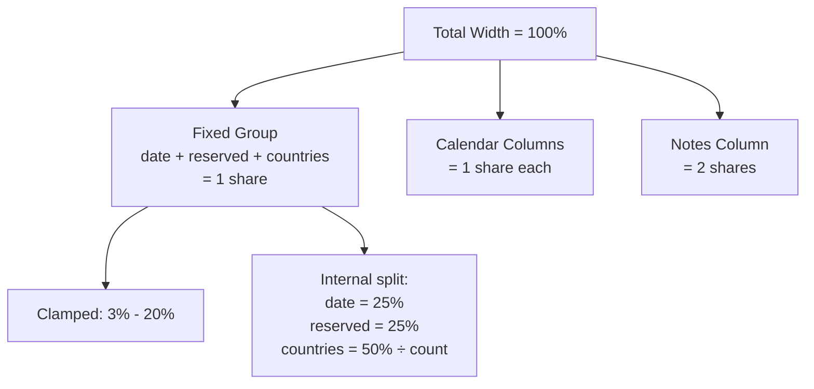
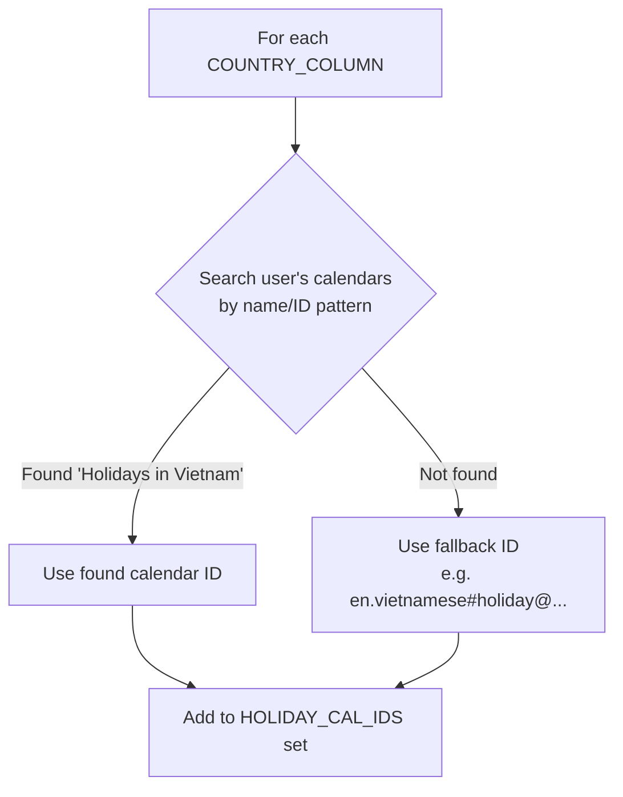

# Column System

## Overview

The column system provides a flexible, reorderable grid where each column type has distinct behavior. Users can show/hide columns and reorder them via the Columns panel.

## Column Types



| Type | Key Pattern | Source | Behavior |
|------|-------------|--------|----------|
| Date | (always first) | Generated | Day name + date number |
| Reserved | `col_reserved` | localStorage + sync | Black opacity blocks, click for picker |
| Country | `col_Vietnam`, etc. | Google Holiday Calendars | Red blocks for holidays |
| Calendar | `col_cal_{id}` | Google Calendar API | Colored blocks for events |
| Notes | `col_notes` | localStorage + sync | Editable text input |

## Column Data Model

Each column is represented as:

```javascript
{
  key: 'col_reserved',     // Unique identifier
  label: 'Reserved',       // Display name
  type: 'fixed'            // 'fixed', 'country', or 'calendar'
}
```

### Default Column Order

```javascript
function getDefaultColumnList() {
  return [
    { key: 'col_reserved', label: 'Reserved', type: 'fixed' },
    ...COUNTRY_COLUMNS.map(cc => ({
      key: 'col_' + cc.name, label: cc.name, type: 'country'
    })),
    ...allCalendars
      .filter(c => !HOLIDAY_CAL_IDS.has(c.id) && !isHolidayCalendar(c))
      .map(c => ({
        key: 'col_cal_' + c.id, label: c.summary || c.id, type: 'calendar'
      })),
    { key: 'col_notes', label: 'Notes', type: 'fixed' },
  ];
}
```

## Column Ordering



```javascript
function getOrderedColumns() {
  const defaults = getDefaultColumnList();
  if (columnOrder.length === 0) return defaults;

  const byKey = {};
  defaults.forEach(c => { byKey[c.key] = c; });

  const ordered = [];
  columnOrder.forEach(key => {
    if (byKey[key]) {
      ordered.push(byKey[key]);
      delete byKey[key];
    }
  });

  // New columns (e.g., newly selected calendar) go at the end
  Object.values(byKey).forEach(c => ordered.push(c));
  return ordered;
}
```

## Column Visibility

Users toggle columns via the Columns panel. Hidden column keys are stored in a `Set`:

```javascript
let hiddenColumns = new Set(
  JSON.parse(localStorage.getItem('mp_hiddenCols') || '[]')
);
```

During rendering, hidden columns are filtered out:

```javascript
const orderedCols = getOrderedColumns().filter(c => !hiddenColumns.has(c.key));
```

## Column Reordering UI

The Columns panel shows each column with up/down arrows and a visibility checkbox:

```
  ▲ ▼ ☑ Reserved
  ▲ ▼ ☑ Vietnam
  ▲ ▼ ☐ Thailand        ← hidden
  ▲ ▼ ☑ China
  ▲ ▼ ☑ Mexico
  ▲ ▼ ☑ US
  ▲ ▼ ☑ Personal
  ▲ ▼ ☑ Work
  ▲ ▼ ☑ Notes
```

```javascript
function moveColumn(index, direction) {
  const columns = getOrderedColumns();
  const newIndex = index + direction;
  if (newIndex < 0 || newIndex >= columns.length) return;

  // Swap
  const temp = columns[index];
  columns[index] = columns[newIndex];
  columns[newIndex] = temp;

  saveColumnOrder(columns);
  renderColumnCheckboxes();
  loadMonth();
}
```

## Column Width Calculation

Widths are proportional, calculated at render time based on visible columns:



### Width Calculation Code

```javascript
const fixedCount = orderedCols.filter(c =>
  (c.type === 'fixed' && c.key !== 'col_notes') || c.type === 'country'
).length;
const calCount = orderedCols.filter(c => c.type === 'calendar').length;
const hasNotes = orderedCols.some(c => c.key === 'col_notes');

const totalShares = (fixedCount > 0 ? 1 : 0) + calCount + (hasNotes ? 2 : 0);
const oneShare = totalShares > 0 ? (100 / totalShares) : 10;

// Fixed group gets 1 share, clamped between 3-20%
const fixedGroup = Math.max(3, Math.min(20, oneShare));
const remaining = 100 - fixedGroup;

// Calendar and notes share the remaining space
const calShares = calCount + (hasNotes ? 2 : 0);
const calPct = calShares > 0 ? (remaining / calShares) : 5;
const notesPct = calPct * 2;

// Split fixed group internally
const countryCount = orderedCols.filter(c => c.type === 'country').length || 1;
const countryShare = (fixedGroup * 0.5) / countryCount;
const datePct = fixedGroup * 0.25;
const reservedPct = fixedGroup * 0.25;
```

### Width Examples

**With 3 calendars, 5 countries:**

| Column | Width |
|--------|-------|
| Date | ~4% |
| Reserved | ~4% |
| Each country (×5) | ~1.7% |
| Each calendar (×3) | ~17% |
| Notes | ~33% |

**With 10 calendars, 5 countries:**

| Column | Width |
|--------|-------|
| Date | ~2% |
| Reserved | ~2% |
| Each country (×5) | ~0.8% |
| Each calendar (×10) | ~7.7% |
| Notes | ~15.4% |

## Holiday Calendar Resolution

Country columns use Google Calendar's built-in holiday calendars. The app auto-detects calendar IDs from the user's subscribed calendars:



```javascript
COUNTRY_COLUMNS.forEach(cc => {
  const found = allItems.find(c => {
    const id = (c.id || '').toLowerCase();
    const name = (c.summary || '').toLowerCase();
    return cc.match.some(m => id.includes(m) || name.includes(m));
  });
  cc.calId = found ? found.id : cc.fallbackId;
  HOLIDAY_CAL_IDS.add(cc.calId);
});
```

Holiday calendars are:
- **Excluded** from the Calendars settings panel (they're always controlled via Columns)
- **Identified** by the pattern `#holiday@group.v.calendar.google.com` in their ID
