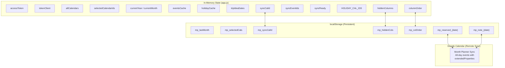
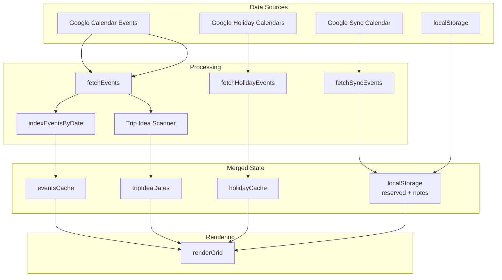

# Data Model & State Management

## State Architecture

The app uses a dual-storage approach: **in-memory state** for runtime and **localStorage** for persistence across sessions. The sync engine adds a third layer via **Google Calendar events**.



## In-Memory State Variables

### Authentication

| Variable | Type | Purpose |
|----------|------|---------|
| `accessToken` | `string \| null` | OAuth 2.0 bearer token |
| `tokenClient` | `object \| null` | Google Identity Services token client |

### Calendar Data

| Variable | Type | Purpose |
|----------|------|---------|
| `allCalendars` | `Array<Calendar>` | All calendars from API (sorted by name) |
| `selectedCalendarIds` | `Array<string>` | IDs of calendars selected for display |
| `currentYear` | `number` | Currently viewed year |
| `currentMonth` | `number` | Currently viewed month (0-indexed) |

### Caches

| Variable | Type | Purpose |
|----------|------|---------|
| `eventsCache` | `Object` | `"YYYY-MM"` → `{ calId → { "YYYY-MM-DD" → [events] } }` |
| `holidayCache` | `Object` | `"timeMin-calId"` → `{ "YYYY-MM-DD" → ["Holiday Name"] }` |
| `tripIdeaDates` | `Object` | `"YYYY-MM-DD"` → `{ level, title, isFirstDay }` |

### Sync State

| Variable | Type | Purpose |
|----------|------|---------|
| `syncCalId` | `string \| null` | ID of "Month Planner Sync" calendar |
| `syncEventIds` | `Object` | `"YYYY-MM-DD"` → Google Calendar event ID |
| `syncReady` | `boolean` | True once sync calendar is found/created |

### Configuration

| Variable | Type | Purpose |
|----------|------|---------|
| `HOLIDAY_CAL_IDS` | `Set<string>` | Resolved holiday calendar IDs (runtime) |
| `hiddenColumns` | `Set<string>` | Column keys hidden by user |
| `columnOrder` | `Array<string>` | Saved column key order |

## Constants

### Country Columns

```javascript
const COUNTRY_COLUMNS = [
  { name: 'Vietnam',  match: ['vietnam', 'vietnamese'],
    fallbackId: 'en.vietnamese#holiday@group.v.calendar.google.com' },
  { name: 'Thailand', match: ['thailand', 'thai'],
    fallbackId: 'en.thai#holiday@group.v.calendar.google.com' },
  { name: 'China',    match: ['china', 'chinese'],
    fallbackId: 'en.china#holiday@group.v.calendar.google.com' },
  { name: 'Mexico',   match: ['mexico', 'mexican'],
    fallbackId: 'en.mexican#holiday@group.v.calendar.google.com' },
  { name: 'US',       match: ['usa', ' us', 'united states', 'american'],
    fallbackId: 'en.usa#holiday@group.v.calendar.google.com' },
];
```

Each country entry gets a `calId` property resolved at runtime by matching against the user's subscribed calendars. If no match is found, `fallbackId` is used.

### Reserved Levels

```javascript
const RESERVED_LEVELS = [0, 0.25, 0.50, 0.75, 1.0];  // opacity values
const RESERVED_LABELS = ['', 'Planning', 'Considering', 'Confident', 'Reserved'];
```

| Level | Opacity | Label | Meaning |
|-------|---------|-------|---------|
| 0 | 0% | (empty) | No reservation |
| 1 | 25% | Planning | Early stage, avoid if possible |
| 2 | 50% | Considering | Actively looking into it |
| 3 | 75% | Confident | Likely booked |
| 4 | 100% | Reserved | Confirmed |

## localStorage Keys

| Key | Format | Example Value | Purpose |
|-----|--------|---------------|---------|
| `mp_lastMonth` | `"YYYY-M"` | `"2026-2"` | Last viewed month for restore |
| `mp_selectedCals` | JSON array | `["cal1@gmail.com","cal2"]` | Which calendars to show |
| `mp_syncCalId` | string | `"abc123@group..."` | Cached sync calendar ID |
| `mp_hiddenCols` | JSON array | `["col_US","col_notes"]` | Hidden column keys |
| `mp_colOrder` | JSON array | `["col_reserved","col_Vietnam",...]` | Column display order |
| `mp_reserved_YYYY-MM-DD` | `"0"`–`"4"` | `"3"` | Reserved level per date |
| `mp_note_YYYY-MM-DD` | string | `"Flight to Tokyo"` | Manual note per date |

## Trip Idea Data Model

Events with "trip idea" in the title are auto-scanned and parsed:

```javascript
// tripIdeaDates["2026-03-15"] = {
//   level: 3,          // Parsed from "75%" in title
//   title: "trip ideas - 75% Tokyo",
//   isFirstDay: true   // Is this the event's start date?
// }
```

**Parsing logic:**
1. Event summary must contain "trip idea" (case-insensitive)
2. Percentage extracted via regex: `/(\d+)\s*%/`
3. Mapped to levels: `<50%` → 1, `50-74%` → 2, `75-99%` → 3, `100%` → 4
4. Default level 1 (Planning) if no percentage found
5. Highest level wins if multiple trip ideas on same day
6. Title auto-fills Notes column on the event's first day

## Sync Event Data Model

Each synced date is stored as an all-day Google Calendar event:

```javascript
{
  summary: "R3: Confident | Trip to Tokyo",
  description: "Trip to Tokyo",
  start: { date: "2026-03-15" },
  end: { date: "2026-03-16" },  // exclusive (next day)
  extendedProperties: {
    private: {
      mpApp: "monthplanner",     // App identifier for filtering
      mpReserved: "3",           // Reserved level (string)
      mpNote: "Trip to Tokyo"    // Note text
    }
  }
}
```

## Data Flow Diagram


