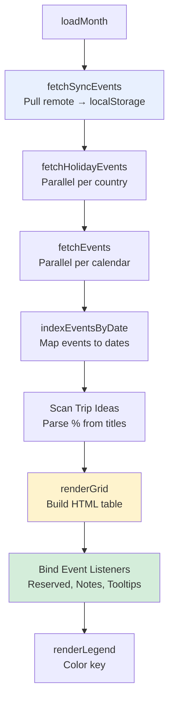
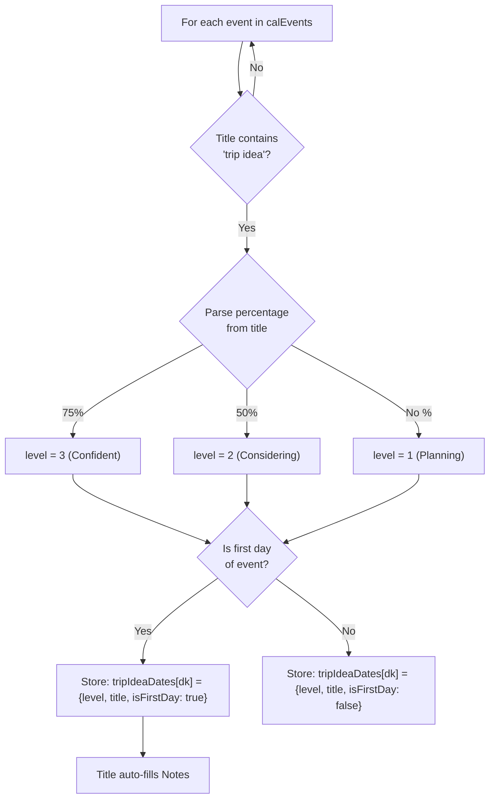
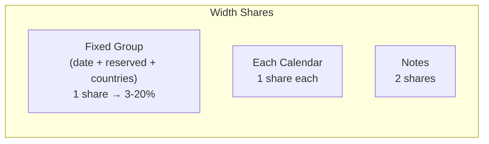
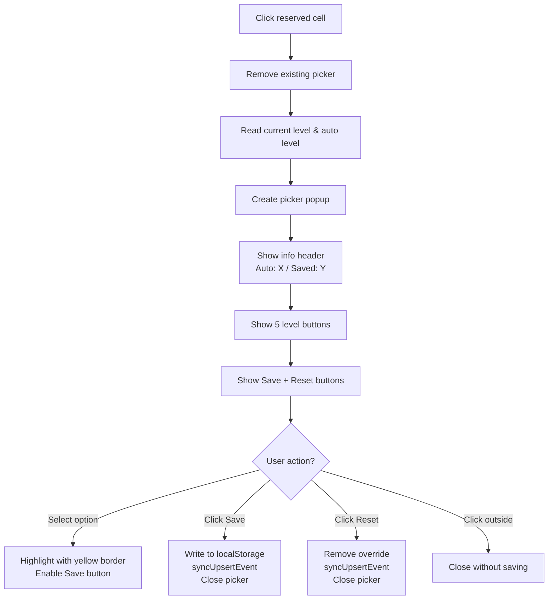
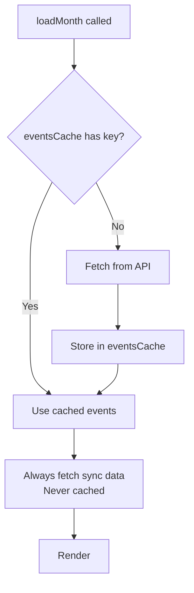

# Rendering Pipeline

## Overview

The rendering pipeline transforms calendar data, holiday data, sync data, and user preferences into an interactive HTML table. All rendering is done via string concatenation (innerHTML) for performance, with event listeners bound after insertion.

## Pipeline Stages



## loadMonth() — Entry Point

```javascript
async function loadMonth() {
  const key = `${currentYear}-${String(currentMonth).padStart(2, '0')}`;
  const selectedCals = allCalendars
    .filter(c => selectedCalendarIds.includes(c.id))
    .filter(c => !HOLIDAY_CAL_IDS.has(c.id) && !isHolidayCalendar(c));

  mainContent.innerHTML = '<div class="loading">Loading events...</div>';

  const timeMin = new Date(currentYear, currentMonth, 1).toISOString();
  const timeMax = new Date(currentYear, currentMonth + 1, 0, 23, 59, 59).toISOString();

  // 1. Pull sync data (remote wins)
  await fetchSyncEvents(timeMin, timeMax);

  // 2. Fetch holidays (parallel)
  const holidayMaps = {};
  await Promise.all(COUNTRY_COLUMNS.map(async cc => {
    holidayMaps[cc.calId] = await fetchHolidayEvents(cc.calId, timeMin, timeMax);
  }));

  // 3. Fetch calendar events (parallel, cached)
  let calEvents;
  if (eventsCache[key]) {
    calEvents = eventsCache[key];
  } else {
    calEvents = {};
    await Promise.all(selectedCals.map(async cal => {
      const events = await fetchEvents(cal.id, timeMin, timeMax);
      calEvents[cal.id] = indexEventsByDate(events, currentYear, currentMonth);
    }));
    eventsCache[key] = calEvents;
  }

  // 4. Scan for trip ideas
  tripIdeaDates = {};
  // ... parse "trip idea" events for reserved levels and notes

  // 5. Render
  renderGrid(selectedCals, calEvents, holidayMaps);
  renderLegend(selectedCals);
}
```

## Event Indexing

`indexEventsByDate()` maps events to their date keys, handling multi-day and all-day events:

```javascript
function indexEventsByDate(events, year, month) {
  const map = {};
  const monthStart = new Date(year, month, 1);
  const monthEnd = new Date(year, month + 1, 0);

  events.forEach(ev => {
    const start = ev.start.dateTime
      ? new Date(ev.start.dateTime)
      : new Date(ev.start.date + 'T00:00:00');
    const end = ev.end.dateTime
      ? new Date(ev.end.dateTime)
      : new Date(ev.end.date + 'T00:00:00');

    // All-day events: end date is exclusive, subtract 1 day
    const endAdjusted = ev.end.date && !ev.end.dateTime
      ? new Date(end.getTime() - 86400000) : end;

    // Clamp to month boundaries
    const d = new Date(Math.max(start.getTime(), monthStart.getTime()));
    const last = new Date(Math.min(endAdjusted.getTime(), monthEnd.getTime()));

    // Add event to each day it spans
    while (d <= last) {
      const key = dateKey(d);
      if (!map[key]) map[key] = [];
      map[key].push(ev);
      d.setDate(d.getDate() + 1);
    }
  });
  return map;
}
```

## Trip Idea Scanning



**Percentage mapping:**

| Title Pattern | Parsed % | Level |
|---------------|----------|-------|
| `"trip idea Tokyo"` | none | 1 (Planning) |
| `"trip ideas - 25% Bangkok"` | 25 | 1 (Planning) |
| `"50% trip idea Paris"` | 50 | 2 (Considering) |
| `"trip ideas - 75%"` | 75 | 3 (Confident) |
| `"trip idea 100% confirmed"` | 100 | 4 (Reserved) |

## renderGrid() — Table Construction

### Column Width Calculation

The grid uses `<colgroup>` for proportional column sizing:



```javascript
// Example: 5 fixed cols + 3 calendars + notes
// totalShares = 1 (fixed) + 3 (cals) + 2 (notes) = 6
// oneShare = 100/6 = 16.67%
// fixedGroup = clamp(16.67, 3, 20) = 16.67%
// calPct = (100 - 16.67) / 5 = 16.67%
// notesPct = 16.67 * 2 = 33.33%

// Within fixed group:
// date = 25% of fixedGroup
// reserved = 25% of fixedGroup
// each country = 50% of fixedGroup / countryCount
```

### HTML Generation

The table is built as a single HTML string for performance:

```
<table class="month-grid">
  <colgroup>
    <col style="width:4.17%">          <!-- date -->
    <col style="width:4.17%">          <!-- reserved -->
    <col style="width:1.67%">          <!-- Vietnam -->
    <col style="width:1.67%">          <!-- Thailand -->
    ...
    <col style="width:16.67%">         <!-- Calendar 1 -->
    <col style="width:16.67%">         <!-- Calendar 2 -->
    <col style="width:33.33%">         <!-- Notes -->
  </colgroup>
  <thead>
    <tr class="header-row">
      <th class="date-header">Date</th>
      <th class="fixed-col-header reserved-header">
        <span class="angled-header">Reserved</span>
      </th>
      ...
    </tr>
  </thead>
  <tbody>
    <tr class="">                       <!-- weekday row -->
      <td class="date-cell">Mon  1</td>
      <td class="fixed-col reserved-cell" data-date="2026-03-01" data-level="0">
      </td>
      ...
    </tr>
    <tr class="weekend">                <!-- weekend row (gray bg) -->
      ...
    </tr>
  </tbody>
</table>
```

### Cell Types

| Cell Type | Class | Content |
|-----------|-------|---------|
| Date | `date-cell` | Day name + number (e.g., "Mon  1") |
| Reserved | `reserved-cell` | Black opacity block (0-100%) |
| Holiday | `holiday-cell` | Red block with holiday name tooltip |
| Calendar Event | `event-cell` | Colored block (calendar color) with event title tooltip |
| Notes | `notes-cell` | Text input field |

### Notes Styling

| Source | Style |
|--------|-------|
| Auto-filled (from trip idea) | Gray (#999), italic |
| Manually typed | Dark (#333), normal weight |

```javascript
const isAuto = !manualNote && noteVal;
const noteStyle = isAuto ? 'color:#999;font-style:italic' : 'color:#333';
```

## Event Binding

After innerHTML is set, event listeners are bound:

### Reserved Picker



### Tooltips

Tooltips follow the mouse cursor and show event details:

```javascript
cell.addEventListener('mouseenter', e => {
  tooltipEl.textContent = cell.dataset.tip;
  tooltipEl.style.display = 'block';
});
cell.addEventListener('mousemove', e => {
  tooltipEl.style.left = (e.clientX + 12) + 'px';
  tooltipEl.style.top = (e.clientY + 12) + 'px';
});
cell.addEventListener('mouseleave', () => {
  tooltipEl.style.display = 'none';
});
```

## Legend

`renderLegend()` builds a color key showing:

1. **Reserved levels** — Black at 25%, 50%, 75%, 100% opacity
2. **Holidays** — Red (#e53935)
3. **Each calendar** — Calendar's `backgroundColor` from Google API

## Caching Strategy



- **Calendar events**: Cached in `eventsCache` by `"YYYY-MM"` key. Navigating back to a month uses the cache.
- **Holiday events**: Cached in `holidayCache` by `"timeMin-calId"` key.
- **Sync events**: Never cached — always fetched fresh to get latest remote data.
