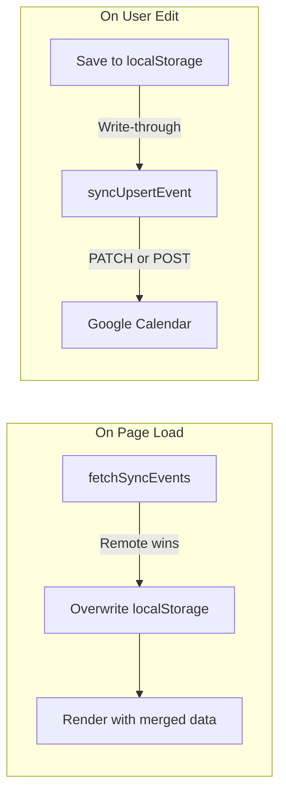
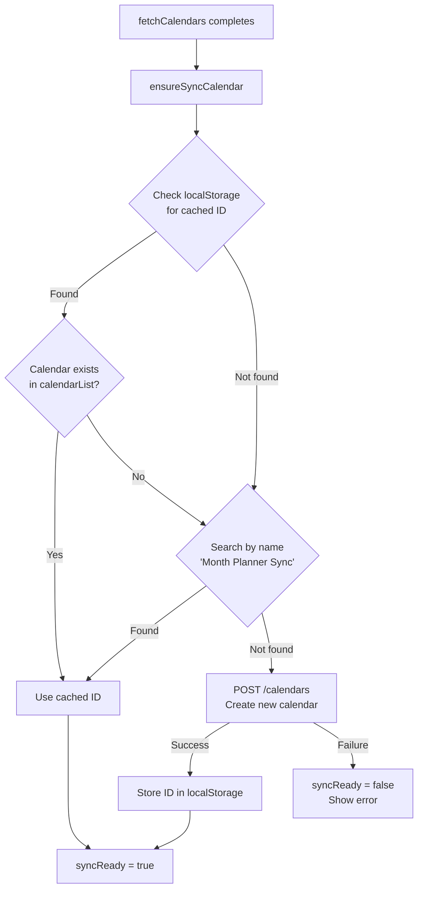
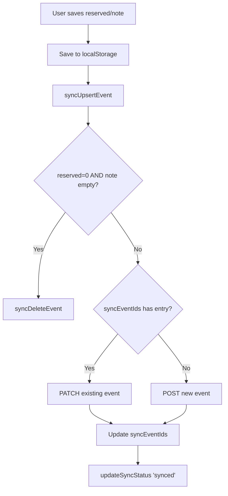

# Sync Engine

## Overview

The sync engine provides 2-way synchronization of Reserved levels and Notes across devices using a dedicated Google Calendar as the storage backend. Data is stored as all-day events with extended properties.

## Sync Strategy



| Scenario | Strategy |
|----------|----------|
| Page load | Remote wins — overwrite localStorage |
| User edit | Write-through — save to both localStorage and API |
| Empty data | Delete sync event when reserved=0 AND note="" |
| Auto-detected trip ideas | NOT synced — derived from calendar events |
| API failure | Silent fallback to localStorage, reconciles on next load |

## Sync Calendar Setup

On first sign-in, the app auto-creates a "Month Planner Sync" calendar:



### Calendar Creation

```javascript
async function ensureSyncCalendar(calendarItems) {
  const cached = localStorage.getItem('mp_syncCalId');

  // Search existing calendars
  const found = calendarItems.find(c =>
    c.id === cached ||
    (c.summary === 'Month Planner Sync' &&
     (c.description || '').includes('Month Planner app'))
  );

  if (found) {
    syncCalId = found.id;
    syncReady = true;
    return;
  }

  // Create new sync calendar
  const resp = await fetch(
    'https://www.googleapis.com/calendar/v3/calendars',
    {
      method: 'POST',
      headers: {
        'Authorization': 'Bearer ' + accessToken,
        'Content-Type': 'application/json',
      },
      body: JSON.stringify({
        summary: 'Month Planner Sync',
        description: 'Auto-created by Month Planner app. Stores reserved levels and notes.',
      }),
    }
  );

  if (resp.ok) {
    const cal = await resp.json();
    syncCalId = cal.id;
    localStorage.setItem('mp_syncCalId', syncCalId);
    syncReady = true;
  }
}
```

## Pull: Fetching Sync Data

On every month load, sync data is pulled from remote before rendering:

```javascript
async function fetchSyncEvents(timeMin, timeMax) {
  if (!syncReady || !syncCalId) return;
  syncEventIds = {};

  const params = new URLSearchParams({
    timeMin, timeMax,
    singleEvents: 'true',
    maxResults: '250',
    privateExtendedProperty: 'mpApp=monthplanner',
  });

  const url = `https://www.googleapis.com/calendar/v3/calendars/` +
    `${encodeURIComponent(syncCalId)}/events?${params}`;
  const data = await apiFetch(url);

  data.items.forEach(ev => {
    const dk = ev.start.date;
    const props = ev.extendedProperties.private || {};

    // Cache event ID for later PATCH/DELETE
    syncEventIds[dk] = ev.id;

    // Remote wins: overwrite localStorage
    const reserved = parseInt(props.mpReserved || '0', 10);
    if (reserved > 0) localStorage.setItem('mp_reserved_' + dk, reserved);
    else localStorage.removeItem('mp_reserved_' + dk);

    const note = props.mpNote || '';
    if (note) localStorage.setItem('mp_note_' + dk, note);
    else localStorage.removeItem('mp_note_' + dk);
  });
}
```

**Key filter:** `privateExtendedProperty=mpApp=monthplanner` ensures only Month Planner events are fetched, even if the user manually adds events to the sync calendar.

## Push: Writing Changes

### Upsert (Create or Update)



```javascript
async function syncUpsertEvent(dk) {
  if (!syncReady || !syncCalId) return;
  updateSyncStatus('saving');

  const reserved = parseInt(localStorage.getItem('mp_reserved_' + dk) || '0', 10);
  const note = localStorage.getItem('mp_note_' + dk) || '';

  // Delete if empty
  if (reserved === 0 && !note) {
    await syncDeleteEvent(dk);
    return;
  }

  // Build human-readable summary
  let summary = '';
  if (reserved > 0) summary = 'R' + reserved + ': ' + RESERVED_LABELS[reserved];
  if (note) summary = summary ? summary + ' | ' + note.substring(0, 40) : 'Note';

  const eventBody = {
    summary,
    description: note || '',
    start: { date: dk },
    end: { date: nextDay(dk) },
    extendedProperties: {
      private: {
        mpApp: 'monthplanner',
        mpReserved: String(reserved),
        mpNote: note,
      },
    },
  };

  const existingId = syncEventIds[dk];
  let resp;

  if (existingId) {
    // PATCH existing event
    resp = await fetch(`.../events/${encodeURIComponent(existingId)}`, {
      method: 'PATCH',
      headers: { 'Authorization': 'Bearer ' + accessToken, ... },
      body: JSON.stringify(eventBody),
    });
  } else {
    // POST new event
    resp = await fetch(`.../events`, {
      method: 'POST',
      headers: { 'Authorization': 'Bearer ' + accessToken, ... },
      body: JSON.stringify(eventBody),
    });
  }

  if (resp.ok) {
    const ev = await resp.json();
    syncEventIds[dk] = ev.id;
    updateSyncStatus('synced');
  }
}
```

### Delete

```javascript
async function syncDeleteEvent(dk) {
  if (!syncReady || !syncCalId) return;
  const existingId = syncEventIds[dk];
  if (!existingId) return;

  await fetch(`.../events/${encodeURIComponent(existingId)}`, {
    method: 'DELETE',
    headers: { 'Authorization': 'Bearer ' + accessToken },
  });
  delete syncEventIds[dk];
  updateSyncStatus('synced');
}
```

## Sync Triggers

| User Action | Trigger | Debounce |
|-------------|---------|----------|
| Reserved picker → Save | `syncUpsertEvent(dk)` | None (immediate) |
| Reserved picker → Reset to auto | `syncUpsertEvent(dk)` | None (immediate) |
| Notes input typing | `syncUpsertEvent(dk)` | 1000ms debounce |
| Month navigation | `fetchSyncEvents()` | None (on load) |

### Notes Debouncing

Notes sync is debounced to avoid API calls on every keystroke:

```javascript
input.addEventListener('input', () => {
  const dk = input.dataset.date;
  localStorage.setItem('mp_note_' + dk, input.value);

  // Debounced sync write — waits 1s after last keystroke
  clearTimeout(input._syncTimeout);
  input._syncTimeout = setTimeout(() => syncUpsertEvent(dk), 1000);
});
```

## Status Indicator

The sync status is displayed in the header next to the sign-in button:

```javascript
function updateSyncStatus(state) {
  const el = document.getElementById('sync-status');
  if (!el) return;
  if (state === 'saving') { el.textContent = 'Saving...'; el.style.color = '#f59e0b'; }
  else if (state === 'synced') { el.textContent = 'Synced'; el.style.color = '#16a34a'; }
  else if (state === 'error') { el.textContent = 'Sync error'; el.style.color = '#dc2626'; }
  else { el.textContent = ''; }
}
```

| State | Color | Meaning |
|-------|-------|---------|
| `saving` | Orange (#f59e0b) | Write in progress |
| `synced` | Green (#16a34a) | All changes saved |
| `error` | Red (#dc2626) | API call failed |

## Conflict Resolution

Since this is a single-user app, conflict resolution is simple:

- **On load**: Remote always wins (overwrites localStorage)
- **During session**: Local edits are authoritative (write-through to remote)
- **API failure**: Data is safe in localStorage; next load reconciles

## API Quota Impact

| Action | API Calls |
|--------|-----------|
| Load a month | 1 (events.list with filter) |
| Save reserved level | 1 (PATCH or POST) |
| Save note | 1 (PATCH or POST, debounced) |
| Heavy editing (31 days, both fields) | ~62 calls |

Google Calendar API quota: ~1,000,000 queries/day per project. Not a concern.
